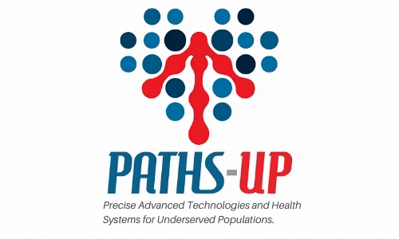
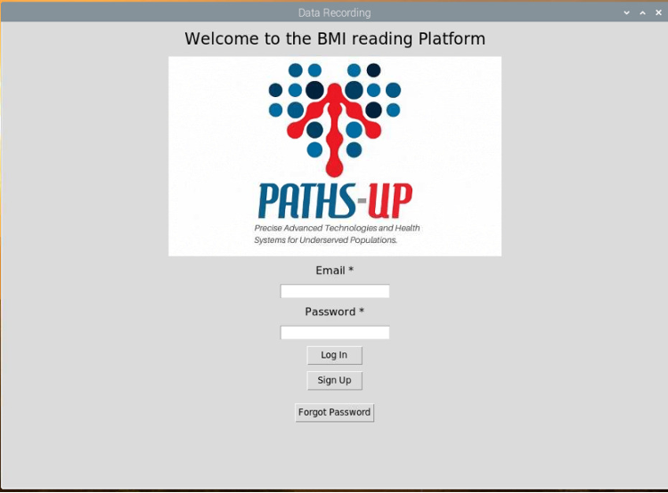
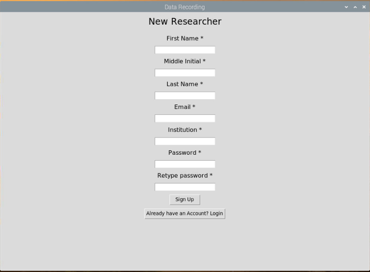
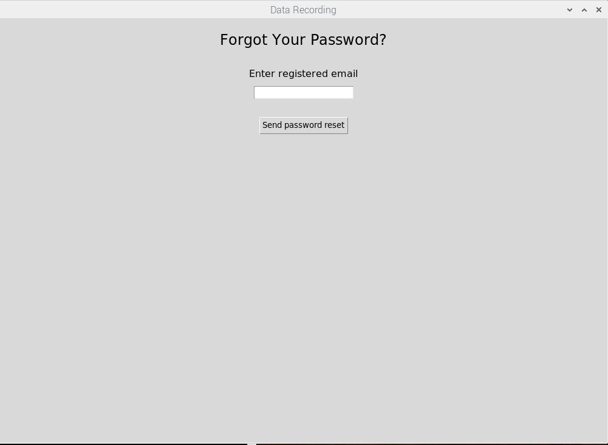
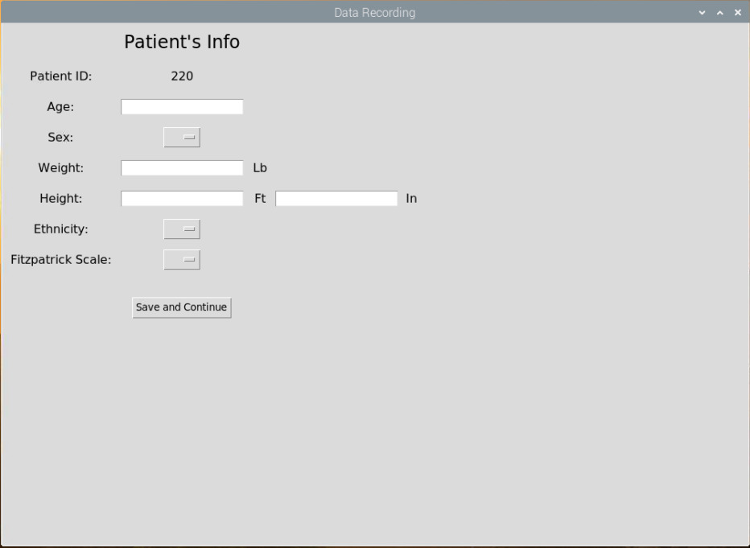
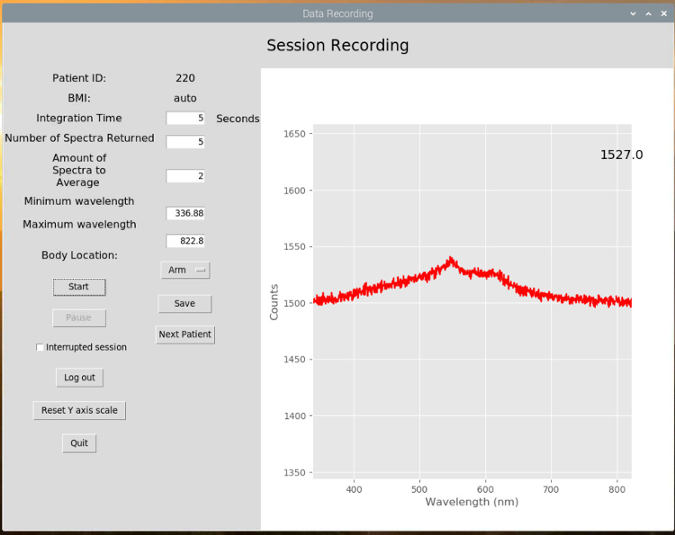

<!-- PROJECT SHIELDS -->
<!--
*** I'm using markdown "reference style" links for readability.
*** Reference links are enclosed in brackets [ ] instead of parentheses ( ).
*** See the bottom of this document for the declaration of the reference variables
*** for contributors-url, forks-url, etc. This is an optional, concise syntax you may use.
*** https://www.markdownguide.org/basic-syntax/#reference-style-links
-->


<!-- PROJECT LOGO -->
<br />
<p align="center">
  <a href="https://github.com/apast005/QMS">
    
  </a>

  <h3 align="center">Enabling Wearable Technology on Patients with High Body Mass Index</h3>

  <p align="center">
    The project aims to provide researchers with a User Interface to control a medical device in development, which keeps measurements of blood pressure and diabetes through the analysis of wavelength and light absorption using a spectrometer. Additionally, the project includes the use of Cloud Computing for Data Analytics from the gathered device data.
    <br />
    <a href="https://github.com/CPRGB/Senior_Design_2020.git"><strong>Explore the docs »</strong></a>
    <br />
    <br />
    <a href="https://www.youtube.com/watch?v=jcINGjAzjmo">View Demo</a>
  </p>
</p>


<!-- TABLE OF CONTENTS -->
## Table of Contents

* [About the Project](#about-the-project)
  * [Built With](#built-with)
* [Getting Started](#getting-started)
  * [Prerequisites](#prerequisites)
  * [Installation](#installation)
* [Usage](#usage)
* [Roadmap](#roadmap)
* [Contributing](#contributing)
* [License](#license)
* [Contact](#contact)
* [References Used](#references)
* [Acknowledgments](#acknowledgments)


<!-- ABOUT THE PROJECT -->
## About The Project

The end goal of this project is to create wearable devices that monitor blood preasure levels and heart rate for overweight population. A user interface (UI) is being developed with different functionalities to facilitate researchers work when logging in patient's information and perform data recorderings. This UI will be running on a Raspberry Pi computer and will allow researchers to start recording sessions and save the gathered data to a database. The data recorded will be processed by an algorithm and displayed on a website accesible by multiple researchers around the world.

### Built With

* [Python3]()
* [Matplotlib]()
* [Microsoft Azure]()
* [Rapberry Pi]()


<!-- GETTING STARTED -->
## Getting Started

To get a local copy up and running follow these simple steps.

### Prerequisites

This code was run and tested on a Raspberry Pi 3b+ that was connected to a STS spectrometer from Ocean Optics. This two components are essential to make this code functional. However, [THIS](https://github.com/jonathanvanschenck/python-seatease) emulator can be used to run and test the code from any computer in the absence of a Raspberry Pi and/or spectrometer.  
* Python-seabreeze
```sh
pip3 install seabreeze
seabreeze_os_setup
```
For more information about this library [click here](https://github.com/ap--/python-seabreeze)

### Installation

1. Clone the repo
```sh
git clone https://github.com/CPRGB/Senior_Design_2020.git
```


<!-- USAGE EXAMPLES -->
## Usage

The graphical user interface makes pretty easy the interaction.

* The "Log in" page authenticates the researcher that will start the data recording on the patient. This screen also allows a new researcher to create an account and recover password in case they forget.
<p align="center">
    
<p align="center">

* The "Sign up" page is just to create a new user(researcher) and it asks for some basic information.
<p align="center">
    
<p align="center">

* The "ResetPassword" page (functionality needs to be implemented) allows to recover password if forgotten, after it authenticates that user's email exists in the database. The plan is to send a unique link for them to reset the password.
<p align="center">
    
<p align="center">

* The "LogPatient" page allows to gather biographical and physical information of the patient. Right before to continue to the next page patient's bmi is calculated and all this information is uploaded to database hosted in Azure.
<p align="center">
    
<p align="center">

* The "DataRecording" page is where all the spectra is gather from different parts of the body. This page allows researcher to set integration time as well as amount of spectra to average. The information gathered will be saved as raw data into .csv files and uploaded to Azure storage account referencing the database by having as name "Patient_ID" underscore "Body_Location" .csv for example "123_Arm.csv"
<p align="center">
    
<p align="center">


<!-- LICENSE -->
## License

Distributed under the MIT License. See `LICENSE` for more information.


<!-- CONTACT -->
## Contact

Alex Pastoriza - <apast005@fiu.edu> <br>
Gustavo Cordido - <gcord018@fiu.edu> <br>
Jose Bello - <jbell139@fiu.edu> <br>
Idiel Guerra - <iguer034@fiu.edu> <br>
Robert Rodriguez - <rrodr630@fiu.edu> 


<!-- ACKNOWLEDGMENTS -->
## Acknowledgments
* [Template for README](https://github.com/othneildrew/Best-README-Template/blob/master/BLANK_README.md)
